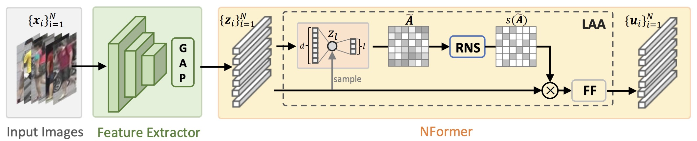

# NFormer

Implementation of NFormer: Robust Person Re-identification with Neighbor Transformer. CVPR2022

## Pipeline
<div align=center>

</div>

## Requirements
 - Python3
 - pytorch>=0.4
 - torchvision
 - pytorch-ignite=0.1.2 (Note: V0.2.0 may result in an error)
 - yacs
## Hardware
 - 1 NVIDIA 3090 Ti

## Dataset
Create a directory to store reid datasets under this repo or outside this repo. Set your path to the root of the dataset in `config/defaults.py` or set in scripts `Experiment-all_tricks-tri_center-market.sh` and `Test-all_tricks-tri_center-feat_after_bn-cos-market.sh`.
#### Market1501
* Download dataset to `data/` from https://zheng-lab.cecs.anu.edu.au/Project/project_reid.html
* Extract dataset and rename to `market1501`. The data structure would like:

```bash
|-  data
    |-  market1501 # this folder contains 6 files.
        |-  bounding_box_test/
        |-  bounding_box_train/
              ......
```


## Training
download the pretrained [resnet50](https://download.pytorch.org/models/resnet50-19c8e357.pth) model and set the path at [line3](configs/softmax_triplet_with_center.yml)

run `Experiment-all_tricks-tri_center-market.sh` to train NFormer on Market-1501 dataset
```
sh Experiment-all_tricks-tri_center-market.sh
```
or 
```
python3 tools/train.py --config_file='configs/softmax_triplet_with_center.yml' MODEL.DEVICE_ID "('0')" DATASETS.NAMES "('market1501')" DATASETS.ROOT_DIR "('/home/haochen/workspace/project/NFORMER/')" OUTPUT_DIR "('work_dirs')"
```

## Evaluation
run `Test-all_tricks-tri_center-feat_after_bn-cos-market.sh` to evaluate NFormer on Market-1501 dataset. Change `TEST.TEST_NFORMER` to determine test for NFormer (`'yes'`) or CNNEncoder (`'no'`).

```
sh Test-all_tricks-tri_center-feat_after_bn-cos-market.sh
```
or 
```
python3 tools/test.py --config_file='configs/softmax_triplet_with_center.yml' MODEL.DEVICE_ID "('0')" DATASETS.NAMES "('market1501')" DATASETS.ROOT_DIR "('/home/haochen/workspace/project/NFORMER')" MODEL.PRETRAIN_CHOICE "('self')" TEST.WEIGHT "('test/nformer_model.pth')" TEST.TEST_NFORMER "('no')"
```

 

## Acknowledgement
This repo is highly based on [reid-strong-baseline](https://github.com/michuanhaohao/reid-strong-baseline), thanks for their excellent work.

## Citation
```
@article{wang2022nformer,
  title={NFormer: Robust Person Re-identification with Neighbor Transformer},
  author={Wang, Haochen and Shen, Jiayi and Liu, Yongtuo and Gao, Yan and Gavves, Efstratios},
  journal={arXiv preprint arXiv:2204.09331},
  year={2022}
}

@InProceedings{Luo_2019_CVPR_Workshops,
author = {Luo, Hao and Gu, Youzhi and Liao, Xingyu and Lai, Shenqi and Jiang, Wei},
title = {Bag of Tricks and a Strong Baseline for Deep Person Re-Identification},
booktitle = {The IEEE Conference on Computer Vision and Pattern Recognition (CVPR) Workshops},
month = {June},
year = {2019}
}
```


